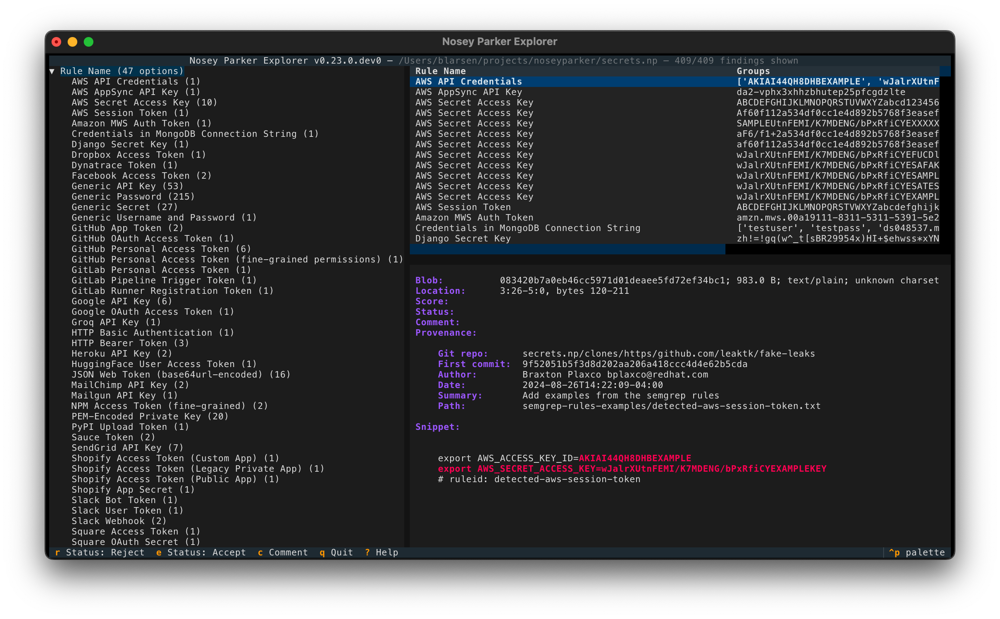
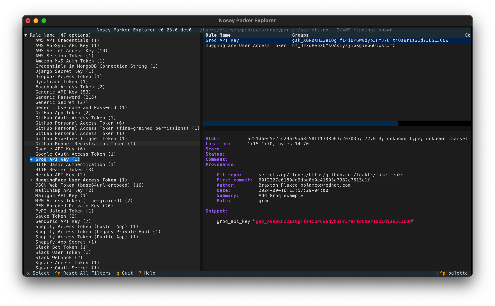
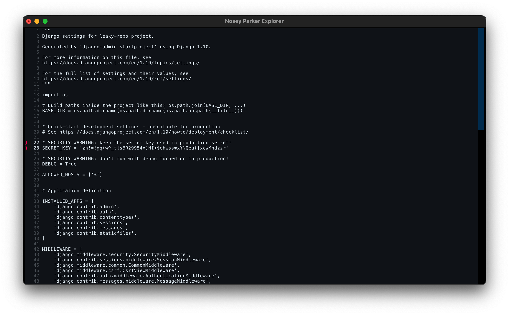
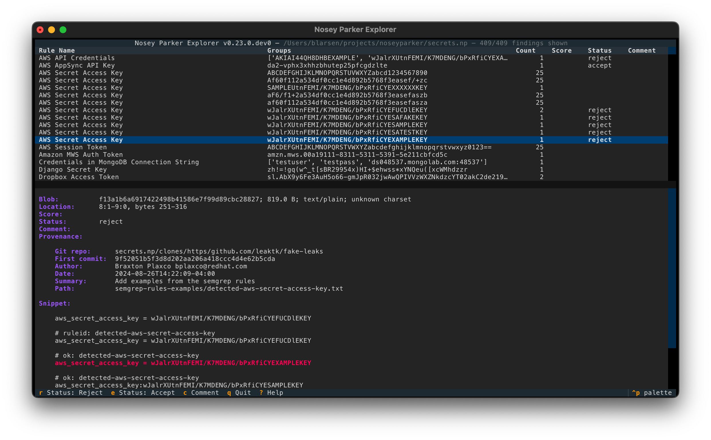
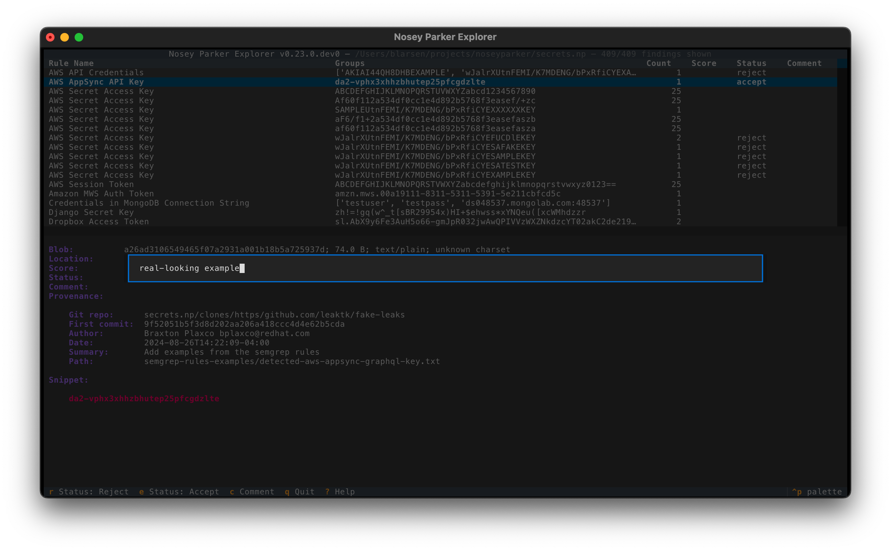
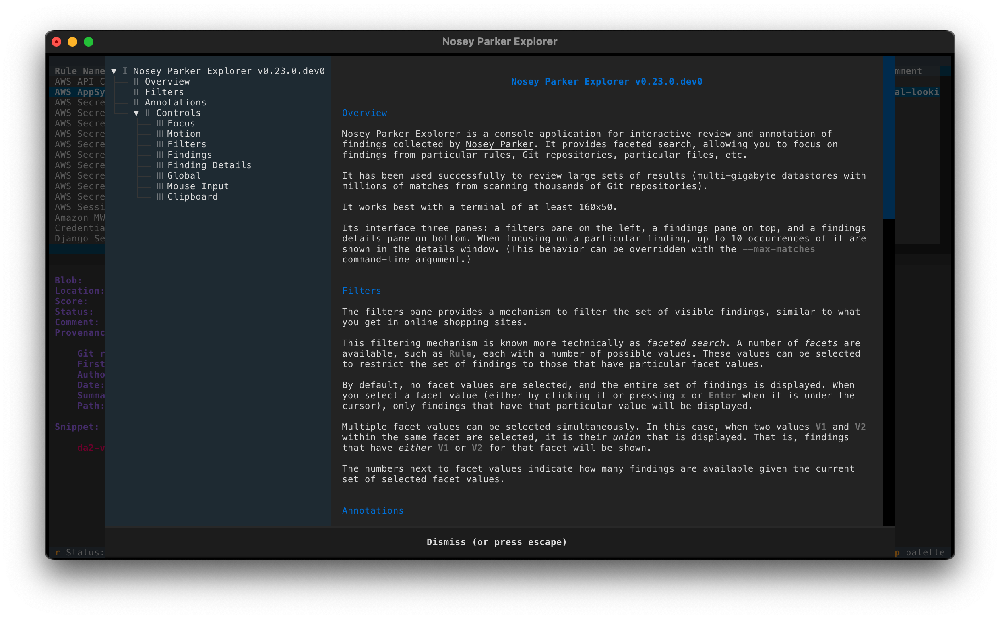

# Nosey Parker Explorer

Nosey Parker Explorer is a TUI application for interactive review and annotation of findings from [Nosey Parker](https://github.com/praetorian-inc/noseyparker), the secrets detector.
It has been used on hundreds of offensive security engagements at [Praetorian](https://praetorian.com) to quickly triage tens of thousands of findings.

Nosey Parker Explorer is built on the [Textual](https://github.com/Textualize/textual) TUI framework.
It works best with a terminal of at least 160x50.


## Features

### Three main panes

Its main screen has three panes: a filters pane on the left, a findings pane on top, and a findings details pane on bottom.
When focusing on a particular finding, up to 10 occurrences of it are shown in the details window.

### Faceted search to rapidly focus on particular types of findings

The filters pane provides faceted search of the results, similar to what is provided in online shopping sites.
Its visibility can be toggled by pressing `F7`.

### Full source file view

The full source for a match can be viewed from by pressing `o` when a match is selected in the details pane.

### Status annotation and commenting


In the findings pane, you can assign a status to a finding (either `accept` or `reject`).
You can also assign a freeform comment if you wish.
Any status or comment you assign will be saved to the Nosey Parker datastore you have opened.

Note that Nosey Parker's own `report` command understands these annotations; it can produce a static report of findings with a particular status using its `--finding-status={accept,reject,mixed,null}` option.

### Integrated help

Integrated help can be accessed by pressing `?`.


## Installation

Nosey Parker Explorer is a Python program that uses a few non-standard-library dependencies.
It requires Python 3.10 or newer.

### Option 1: Use a prepackaged Python zipapp from a release

Prepackaged Python [zipapps](https://docs.python.org/3/library/zipapp.html) (produced by [`shiv`](https://github.com/linkedin/shiv)) are provided for Linux and macOS for each release.
This installation option is simplest: there is no need to set up a venv or `pip install` anything; all you need is a Python 3.10+ interpreter.

First, download the appropriate artifact for your Python version, OS, and CPU architecture from the [latest release](https://github.com/praetorian-inc/noseyparkerexplorer/releases/latest).
Extract that zip file; within is a single file named `noseyparker-explorer`.
(This single `noseyparker-explorer` file is a Python zipapp.)

Finally, to run, point it at a Nosey Parker datastore directory (which should contain a `datastore.db` file):
```
$ python3 noseyparker-explorer -d <DATASTORE_DIR>
```

### Option 2: Install from source

Use [uv](https://docs.astral.sh/uv):
```
$ uv sync
$ uv run noseyparker-explorer -d <DATASTORE>
```

NOTE: the versions of Python available in `apt` in Ubuntu 20.04 include a version of sqlite3 that is too old for Nosey Parker Explorer.


### Option 3: Install from source, developer version

Use [uv](https://docs.astral.sh/uv):
```
$ uv sync --group dev
$ uv run noseyparker-explorer -d <DATASTORE>
```

NOTE: the versions of Python available in `apt` in Ubuntu 20.04 include a version of sqlite3 that is too old for Nosey Parker Explorer.

## Usage

Nosey Parker Explorer has an integrated help pane that explains usage in more detail.
Activate it by pressing `?`.

### Filters

The filters pane provides a mechanism to filter the set of visible findings, similar to what you get in online shopping sites.

This filtering mechanism is known more technically as _faceted search_.
A number of _facets_ are available, such as `Rule`, each with a number of possible values.
These values can be selected to restrict the set of findings to those that have particular facet values.

By default, no facet values are selected, and the entire set of findings is displayed.
When you select a facet value only findings that have that particular value will be displayed.

Multiple facet values can be selected simultaneously, which causes the union of those values to be displayed.

The numbers next to facet values indicate how many findings are available given the current set of selected facet values.

### Annotations

You can assign a status (either `accept` or `reject) and freeform comments to both findings and individual matches.
These annotations are included in the output of `noseyparker report`.
That command can also filter output by assigned status (e.g., `noseyparker report --finding-status accept` to only show accepted findings).

Any status or comment you assign will be saved to the Nosey Parker datastore you have opened.
Your data will not be lost.

### Copying text

Nosey Parker Explorer puts your terminal in to application mode which disables clicking and dragging to select text.
It _is_ possible to copy from Nosey Parker Explorer, but it probably requires pressing a modifier key as you click and drag:

- iTerm2: the `Fn` or Option key
- Gnome Terminal: the Shift key

Other terminals may use other modifier keys.


## Contributing

Feedback, bug reports, and feature requests are welcome; please [open an issue](https://github.com/praetorian-inc/noseyparkerexplorer/issues/new/choose).

Pull requests are also welcome.
If you are considering a substantial change (more than just a bugfix or small addition), consider [starting a discussion](https://github.com/praetorian-inc/noseyparkerexplorer/discussions/new/choose) first.

This project has a number of [pre-commit](https://pre-commit.com/) hooks enabled that you are encouraged to use.
To install them in your local repo, make sure you have `pre-commit` installed and run:
```
$ pre-commit install
```
These checks will help to quickly detect simple errors.


## License

Nosey Parker Explorer is licensed under the [Apache License, Version 2.0](LICENSE).

Any contribution intentionally submitted for inclusion in Nosey Parker by you, as defined in the Apache 2.0 license, shall be licensed as above, without any additional terms or conditions.
